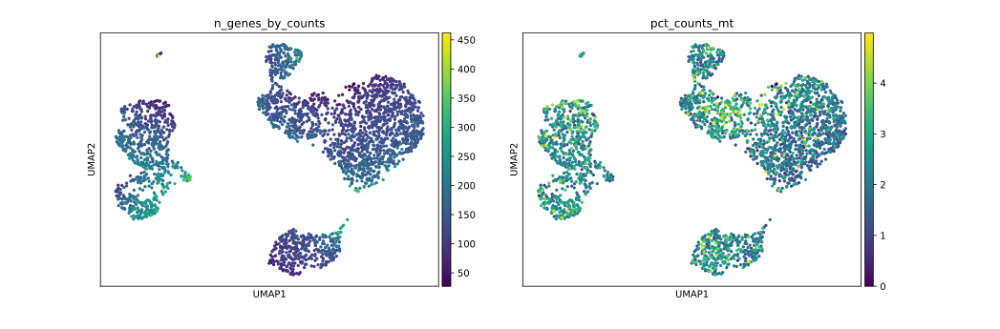

# scVAE-State: Deep Generative Modeling of Cellular Latent Manifolds

## Project Overview
scVAE-State is a research-grade pipeline designed to model cellular heterogeneity using Variational Autoencoders (VAEs). By training on real-world scRNA-seq data (10x Genomics PBMC 3k), the model learns a continuous latent manifold that represents distinct immune cell states. This project demonstrates how deep generative models can be used to understand why cells respond differently to identical stimuli[cite: 2, 4].

## Key Features
*   **Automated Pipeline:** End-to-end execution from raw data download to biological visualization.
*   **Biological QC:** Integrated filtering for mitochondrial transcript percentage to ensure manifold quality[cite: 3].
*   **Custom Architecture:** PyTorch implementation of a VAE with a Softplus-activated decoder to maintain non-negative gene count reconstruction[cite: 4].
*   **Latent Manifold Analysis:** UMAP projection and latent space traversal for modeling cellular transitions[cite: 2, 3].

## Repository Structure
*   `models/`: Contains the VAE architecture[cite: 1].
*   `scripts/`: Modular scripts for preprocessing, training, and evaluation[cite: 1].
*   `data/`: Directory for processed .h5ad files (gitignored)[cite: 3].
*   `figures/`: Generated UMAP and marker gene validation plots.

## Installation
1. Clone the repository:
   `git clone https://github.com/yourusername/scVAE-State.git`
2. Install dependencies:
   `pip install -r requirements.txt`[cite: 2]

## Usage
Run the entire pipeline with a single command:
`chmod +x run_pipeline.sh`
`./run_pipeline.sh`[cite: 1]

## Biological Results & Validation
The model successfully identifies major immune populations in the PBMC 3k dataset[cite: 2, 3]. Validation was performed using canonical marker genes:
*   **T-cells:** CD3E, CD4, CD8A[cite: 2].
*   **B-cells:** MS4A1, CD19[cite: 2].
*   **Monocytes:** LYZ, CD14[cite: 2].

## License
This project is licensed under the MIT License.
